# Introduction:

**Analyzing American Baby Names:** I recently completed a dynamic project centered around American baby names🍼💡   . Thrilled by the endless possibilities of data exploration, I began this SQL project inspired by Data Camp 🚀📊. With the goal of uncovering insights within the extensive dataset provided by the United States Social Security Administration, I wielded the power of SQL to reveal fascinating trends, patterns, and the evolving popularity of names over the past century 📈🔍.

I used the power of SQL to unravel the vast datasets, offering a fascinating exploration into the ever-evolving landscape of baby names 👶📊. From timeless classics to emerging trends, I navigated through decades of data to uncover patterns, trends, and the enduring popularity of names, all while deepening my understanding of SQL's capabilities and functionalities 🚀.

join me as we dive into the world of SQL queries and uncover the stories hidden within the baby names dataset! ✨🔍

SQL queries? Check them out here: [Project_baby_names](/Project_baby_names/)


[View Baby Names Dashboard on Tableau Public](https://public.tableau.com/app/profile/jheel.jagani/viz/Baby_Names_17129559109220/Dashboard1?publish=yes)


# Background: 

In this project, we're analyzing changes in American baby name preferences since 1910 using dataset from the United States Social Security Administration. We're exploring which names have remained popular for over a century and comparing them to recent top names. This not only helps new parents but also hones skills applicable to understanding trends and popularity in various industries. 🍼💼

# Dataset:

The dataset comprises detailed records of baby names from the United States, capturing over a million entries. 


| Column | Description |
| ------ | ----------- |
| Id     | The unique identifier for each name record |
| Name   | The given first name of the baby. |
| Year   | The year the name was registered. |
| Gender | The gender of the baby (`M` for male, `F` for female). |
| State  | The U.S. state where the name was registered. |
| Count  | The number of occurrences of the name in that particular year and state. |


# Objective:


### Below are the questions I aimed to answer through my analysis:


1️⃣ Names chosen for over a century?

2️⃣ Differences in name popularity types?

3️⃣ Top female names since 1920?

4️⃣ Trendy female names ending with 's' post-2010?

5️⃣ Rise of 'Alexis' in popularity?

6️⃣ Male names with consistent popularity?

7️⃣ Yearly most popular male names?

8️⃣ Male name most often at number one?


### Washington State Specific: 


As a resident of Washington (WA), I was particularly curious about conducting a specific analysis for our state, delving into the unique trends and patterns of baby names within our community. 🌟🍼

1️⃣ All-time favorites in Washington?

2️⃣ Recent trendy names in Washington?

3️⃣ Unique Washington names?

4️⃣ Decadal name trends in Washington?

5️⃣ Top gender-neutral names in Washington?


# Tools I Used:


In my Data Analyst job market project, I utilized a dynamic suite of tools to navigate and analyze data effectively:

- **SQL & PostgreSQL:** 📊 SQL and PostgreSQL formed the backbone, enabling seamless querying and analysis of job market data.

- **Visual Studio Code:** 💻 Visual Studio Code provided the canvas for coding, offering a user-friendly interface and a plethora of extensions for efficient development.

- **Git:** 🔄 Git kept track of every twist and turn in the project's journey, ensuring version control and collaboration.

- **GitHub:** 🌐 GitHub served as the central repository, fostering collaboration and sharing insights with the community.


# The Analysis: 


In this project I have employed a variety of SQL techniques:

 - Including utilizing CASE WHEN statements for conditional logic.

 - Pattern matching using the LIKE operator to identify specific name endings.

 - Incorporating subqueries to filter and analyze subsets of data.

 - Leveraging common table expressions (CTEs) for organizing and simplifying complex queries.

 - Harnessing the power of window functions for advanced analytical tasks such as calculating cumulative counts and identifying trends over time. 


 ## 1. Ten Classic American names:


 This query aims to identify top 10 classic American baby names by selecting names that have been consistently popular across the span of 105 years, from 1910 to 2010.


 ```sql
SELECT Name, SUM(Count) AS total_babies
FROM names
WHERE year BETWEEN 1910 AND 2014
GROUP BY Name 
HAVING COUNT(DISTINCT Year) = 105
ORDER BY total_babies DESC;
```


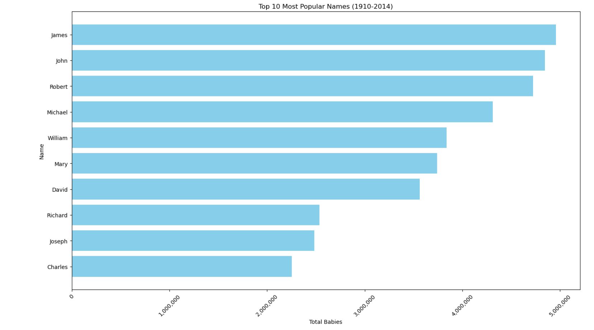

*This bar chart visualizes the top 10 most consistently popular names from 1910 to 2014, ranked by their total occurrences, showcasing the enduring popularity of names like James, John, and Robert.*


## 2. Timeless or trendy?


This SQL query categorizes names based on their historical popularity by counting the total number of babies given those names across different years. 

Names are classified as "Classic," "Semi-classic," "Semi-trendy," or "Trendy" based on the number of years they appear in the data, reflecting their timelessness or trendiness.


```sql
SELECT Name, SUM(Count) AS total_babies,
  CASE
    WHEN COUNT(DISTINCT Year) > 80 THEN 'Classic'
    WHEN COUNT(DISTINCT Year) BETWEEN 50 AND 80 THEN 'Semi-classic'
    WHEN COUNT(DISTINCT Year) BETWEEN 20 AND 49 THEN 'Semi-trendy'
    ELSE 'Trendy'
  END AS popularity_type
FROM names
GROUP BY Name
ORDER BY Name;
```


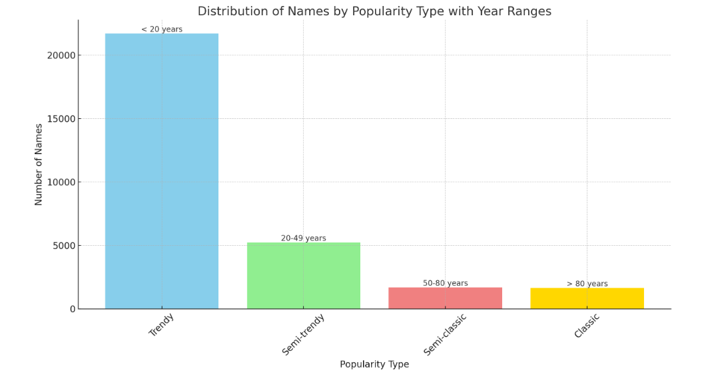

*The bar bar chart visually represents the distribution of names by their popularity type, with annotations indicating the year ranges associated with each category*

**Trendy:** Names appearing in fewer than 20 years.

**Semi-trendy:** Names appearing between 20 and 49 years.

**Semi-classic:** Names appearing between 50 and 80 years.

**Classic:** Names appearing in over 80 years.


## 3. What are the Top-ranked female names since 1920?


The purpose of the SQL query is to rank the top 10 female names by the total count of babies born since 1920, providing a historical view of the most popular female names over the last century.This SQL query provided the opportunity to practice window functions by assigning a rank to female names based on the number of babies that have ever been given that name. 


```sql
SELECT RANK() OVER (ORDER BY SUM(count) DESC) AS name_rank, name, SUM(count) AS total_babies
FROM names
WHERE year >= 1910 AND gender = 'F'
GROUP BY name
ORDER BY total_babies DESC
LIMIT 10;
```

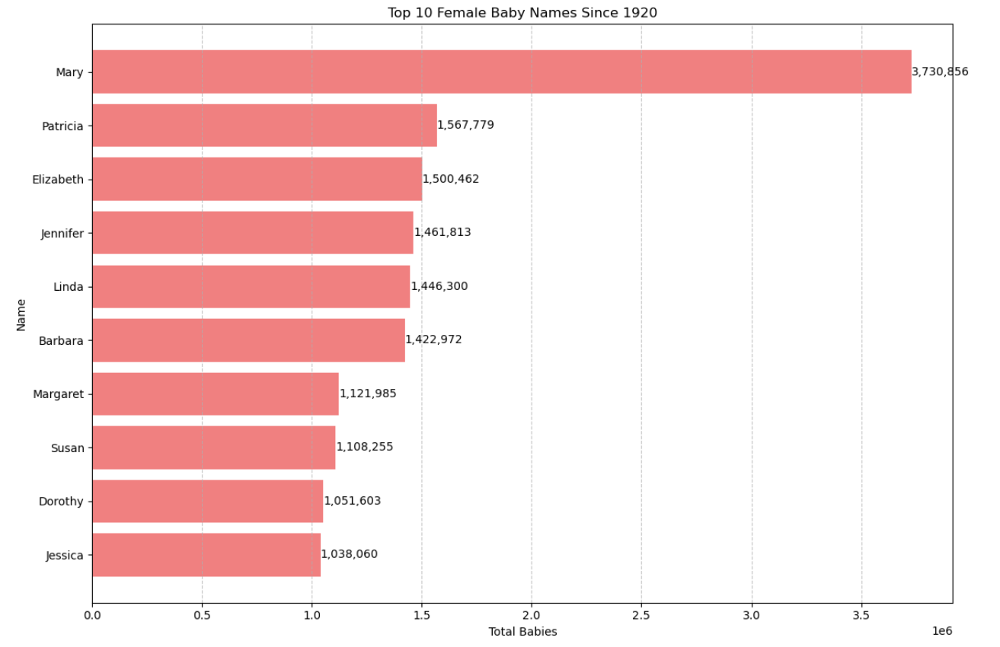

*The chart highlights the enduring popularity of classic names, with "Mary" notably outpacing all others as the most chosen name for female babies since 1920.*


## 4. Picking a baby name: 

This SQL query is designed to determine the top 20 most popular female names ending in "s" born after the year 2010, providing recent trends in baby naming.

```sql
SELECT name, SUM(count) AS total_babies
FROM names
WHERE gender = 'F' AND year > 2010 AND name LIKE '%s'
GROUP BY name
ORDER BY total_babies DESC
LIMIT 20;
```

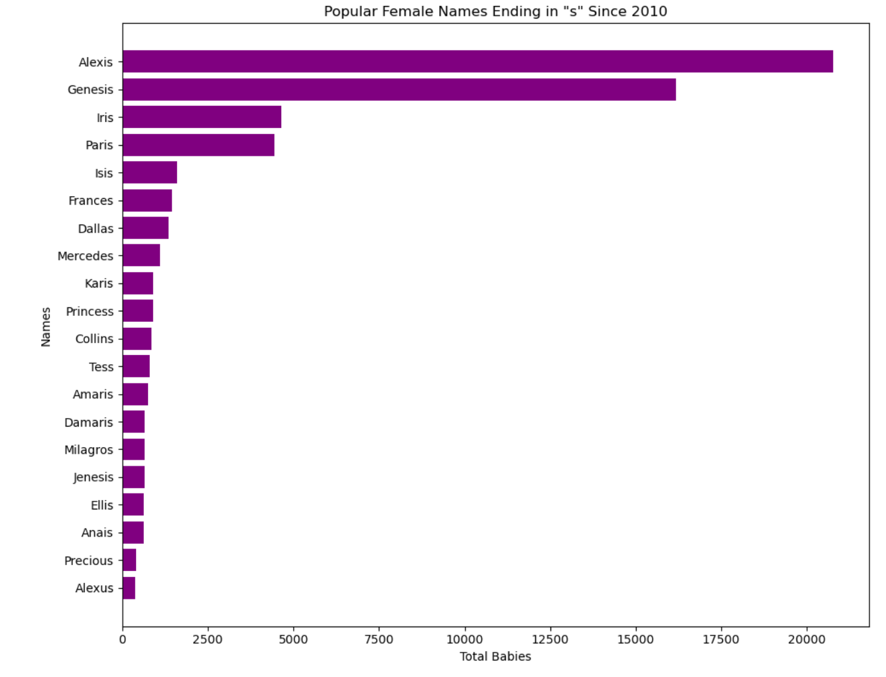

*The name "Alexis" significantly leads in popularity among female names ending in 'S' since 2010, with "Genesis" as a distant second.*


## 5. The Alexis expansion:

Based on the results in the previous query, we can see that Alexis is the most popular female name ending in 'S' since 2010. When did the name Alixis become so popular? Let's explore the rise of the name Alexis with the help of a window function.

```sql
SELECT year, name, count, SUM(count) OVER (ORDER BY year) AS cumulative_olivias
FROM names
WHERE name = 'Alexis'
ORDER BY year;
```

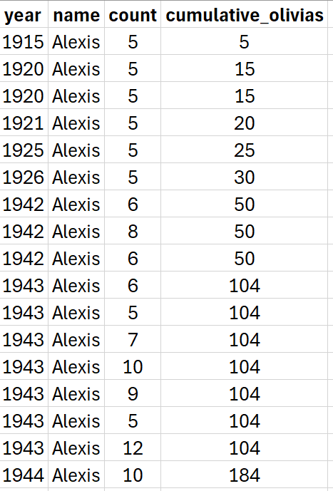

*The year 1998 stands out in the dataset: This year saw the highest number of babies named Alexis, with a total of 2,074. It was a significant year for the popularity of the name Alexis*


## 6. Many males with the same name:

This SQL query retrieves the maximum count of babies born in a given year with a male gender. The purpose is to identify the top 10 number of male births in each year, providing insights into 
trends or fluctuations in male baby names popularity over time.


```sql
SELECT
    Year,
    MAX(Count) AS  max_num
FROM names
WHERE Gender = 'M'
GROUP BY Year
ORDER BY max_num DESC
LIMIT 10;
```

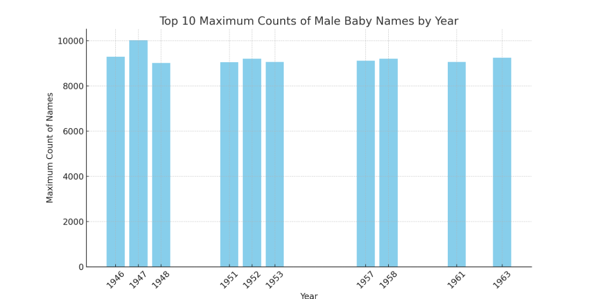


*This bar chart visualizing the top 10 years with the highest counts of male baby names. Each bar represents the maximum number of babies born with the most popular male name in that particular year, giving a clear picture of the distribution and trends over time.*

*We can see that the year 1947 stands out with a significantly higher count of male babies sharing the most popular name compared to other years in the dataset. This peak could indicate a particular trend or social influence around that time that caused one male baby name to surge in popularity.*

*It's also noteworthy that all the years in the top 10 are within a 16-year span from 1946 to 1963, which could suggest that naming conventions were more homogenous during this post-World War II period, possibly due to cultural factors or influential figures of the time.*

## 7. Top male names over the years:

In the previous query, we found the maximum number of babies given any one male name in each year. 
In this query, we will find out what top male name are for each year in our dataset.


```sql
WITH MaxNamePerYear AS (
  SELECT year, MAX(count) AS max_num
  FROM names
  WHERE gender = 'M'
  GROUP BY year
)
SELECT n.year, n.name, n.count
FROM names AS n
JOIN MaxNamePerYear AS mnpy 
ON n.year = mnpy.year AND n.count = mnpy.max_num
WHERE n.gender = 'M'
ORDER BY n.year DESC;
```


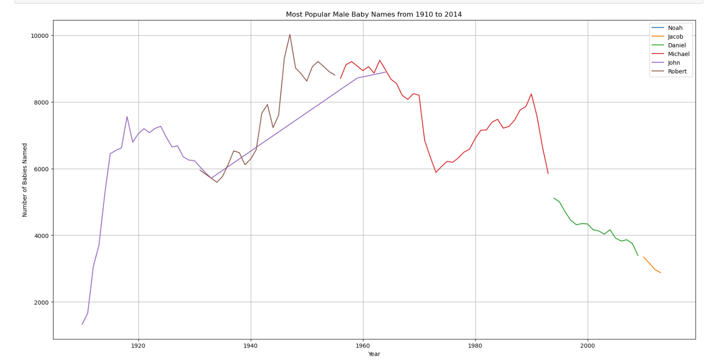


*The visualization traces the popularity of the most popular male baby names from 1910 to around the year 2000, showing a clear dominance of the names "Robert" and "Michael" for several decades.*

*One interesting insight we can see is the sharp rise and prolonged dominance of "Michael" from the 1960s through the 1980s, suggesting a strong cultural preference for this name during that era.*


## 8. The most years at number one:

This SQL query is designed to find male baby names that held the number one spot most frequently over the years. It uses window functions to rank names by their count within each year and then counts how many times each name was ranked first. 


```sql
WITH TopNamePerYear AS (
  SELECT year, name, RANK() OVER (PARTITION BY year ORDER BY count DESC) AS rank
  FROM names
  WHERE gender = 'M'
),
NumberOneNames AS (
  SELECT name
  FROM TopNamePerYear
  WHERE rank = 1
)
SELECT name, COUNT(*) AS count_top_name
FROM NumberOneNames
GROUP BY name
ORDER BY count_top_name DESC;
```

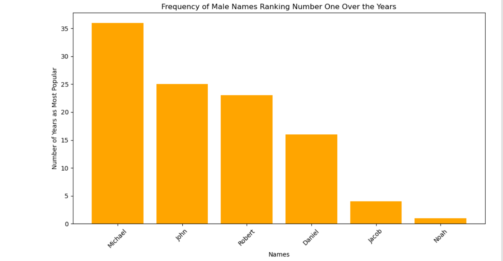

*The bar chart highlights the frequency of certain male names ranking as the most popular over the years, with "Michael" leading significantly, followed by "John," "Robert," "Daniel," "Jacob," and "Noah," in descending order of frequency. This suggests that "Michael" has been a particularly enduring choice for boys' names over the observed time period.*

## Washington State Specific Analysis:

## 1. This SQL query's aim is to determine the 10 most popular names in the state of Washington over all recorded time by summing up the counts of each name.

```sql
SELECT name, state, SUM(count) AS total_babies
FROM names
WHERE state = 'WA'
GROUP BY name, state
ORDER BY total_babies DESC
LIMIT 10;
```

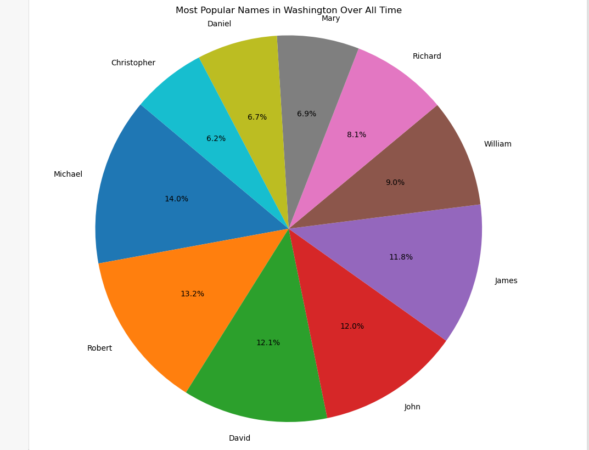

*The pie chart presents the distribution of the most popular names in Washington over all recorded time.*

*Again "Michael" claims the largest segment, indicating it is the most popular name even within this group.*


## 2. This query calculates the average count of each name over all years before 2014 and compares it to the count in 2014 to find names that have become trendy


This query creates three Common Table Expressions (CTEs):

- RecentPopularity: to get the count of each name in 2014.

- HistoricalPopularity: to get the average count of each name before 2014.

- Trendiness: to combine the recent and historical counts and calculate the "trendiness factor" which is the difference between the recent count and the historical average count.

- Finally, it selects names from the Trendiness CTE, orders them by their trendiness factor in descending order, and limits the results to the top 10. 

- This  gives us the names that are most trendy based on the criteria defined.


```sql
WITH RecentPopularity AS (
  SELECT name, count
  FROM names
  WHERE year = 2014 AND state = 'WA'
),
HistoricalPopularity AS (
  SELECT name, AVG(count) as avg_count
  FROM names
  WHERE year < 2014 AND state = 'WA'
  GROUP BY name
),
Trendiness AS (
  SELECT rp.name, rp.count as recent_count, COALESCE(hp.avg_count, 0) as historical_avg
  FROM RecentPopularity rp
  LEFT JOIN HistoricalPopularity hp ON rp.name = hp.name
)
SELECT 
    name, 
    recent_count, 
    ROUND(historical_avg, 2) as historical_avg_count, 
    ROUND((recent_count - historical_avg), 2) AS trendiness_factor
FROM Trendiness
ORDER BY trendiness_factor DESC, recent_count DESC
LIMIT 10;
```

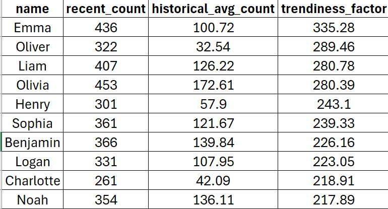

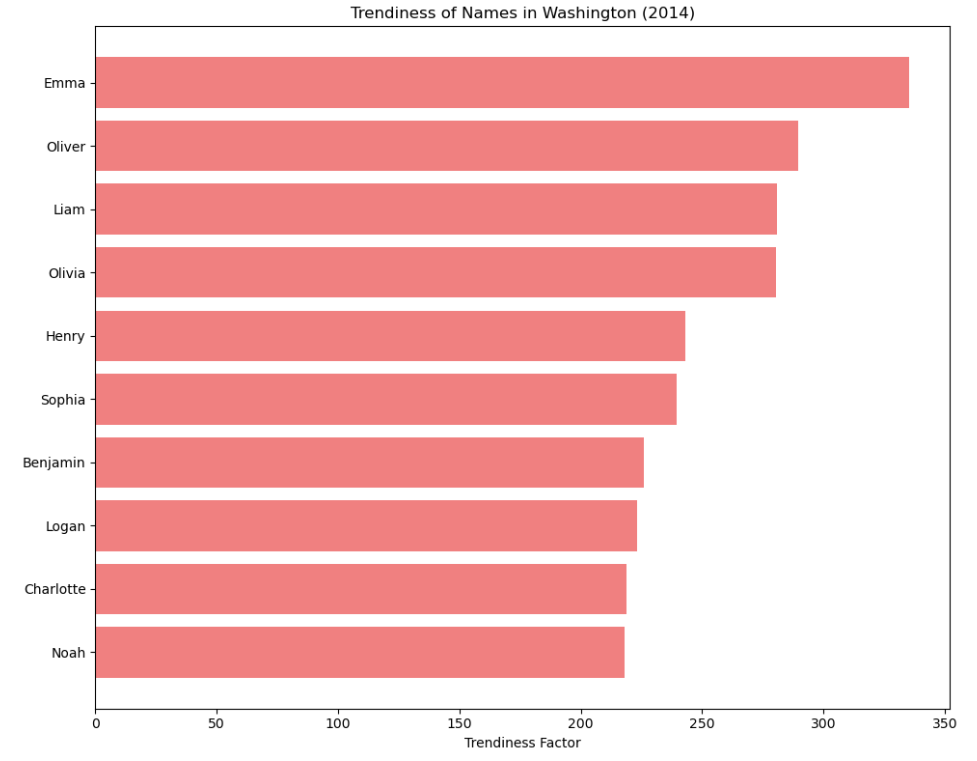

*The graph depicts the "trendiness factor" of various names, indicating how much more popular each name was in 2014 compared to its historical average in Washington.*

*"Emma" has the highest trendiness factor, suggesting a dramatic increase in popularity and possibly reflecting a broader trend in naming preferences in 2014.*


## 3. The SQL query is designed to find the most popular names that are unique to Washington by excluding any names that also appear in other states' records.


```sql
SELECT WA.name, WA.total_babies
FROM (
  SELECT name, SUM(count) AS total_babies
  FROM names
  WHERE state = 'WA'
  GROUP BY name
) AS WA
LEFT JOIN (
  SELECT name, SUM(count) AS total_babies
  FROM names
  WHERE state <> 'WA'
  GROUP BY name
) AS Other ON WA.name = Other.name
WHERE Other.name IS NULL
ORDER BY WA.total_babies DESC;
```

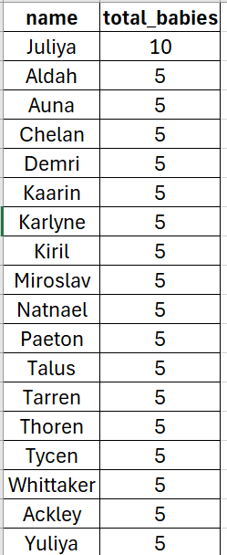

*The provided list represents names that are unique to Washington state, with the number of babies given each name.*
 
*"Juliya" tops the list with 10 births, while all other names have been given to 5 babies each.*

*This suggests a range of distinctive names that, while not widespread, have a particular resonance in Washington, possibly reflecting cultural, historical, or local influences specific to the state*

# Key Insights:

- **Historical Constants:** Names like James, John, and Robert have remained popular for over a century, highlighting their timeless appeal.

- **Cultural Reflections:** The prevalence of certain names like Michael in specific decades points to cultural or societal influences at play during those times.

- **Regional Distinctiveness:** Unique names in Washington state, such as Juliya, suggest local influences or preferences that differ from nationwide trends.

- **Trendy Names:** Recent spikes in the popularity of names like Emma and Oliver indicate shifting trends, possibly influenced by modern cultural or media phenomena.

# What I Learned:

- Aggregate Functions: Used SUM to compile total counts and AVG to determine historical averages.

- Conditional Logic: Applied CASE WHEN statements to categorize names based on longevity and popularity.

- Pattern Matching: Utilized the LIKE operator to filter names with specific endings.

- Complex Filtering: Employed subqueries and CTEs for organizing and executing multi-step queries.

- Ranking and Trends: Leveraged window functions to rank names and calculate cumulative counts.

# Conclusion:

Names are a mirror to our society, reflecting our values, inspirations, and even our collective psyche at any given moment. This project has not just been about understanding SQL or navigating datasets; it has been about deciphering the subtle language of our cultural evolution. 

As I conclude this project, I'm struck by the richness of the narrative that data can unfold and the powerful tools at our disposal to narrate this story. The insights gained are not just data points; they are the names of our past, the echoes of our present, and perhaps, the whispers of our future.


